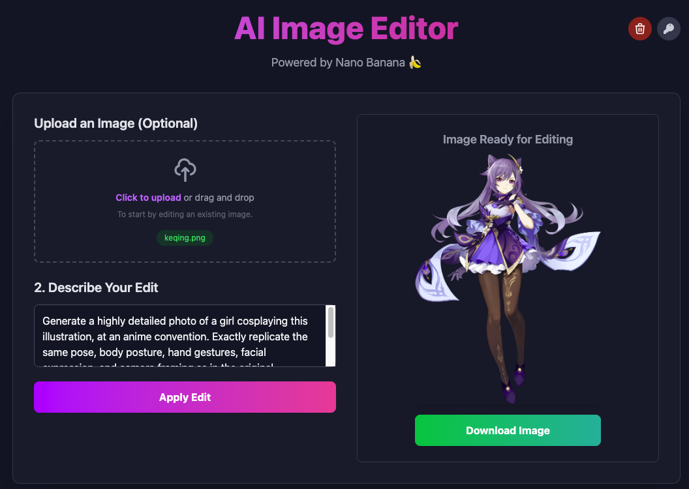
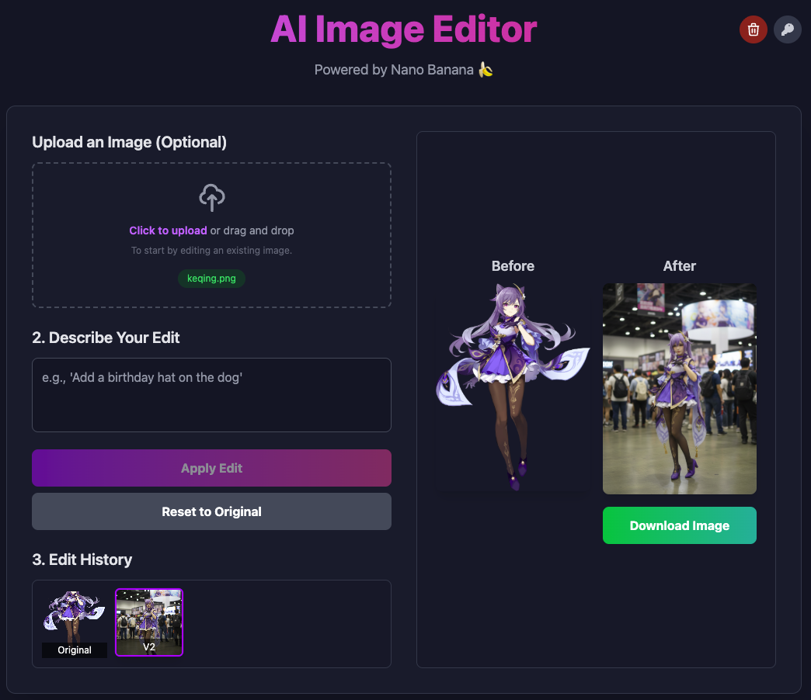

# AI Image Editor

A web UI that leverages the Google Gemini API to generate and edit images directly in your browser. Create new visuals from text prompts or upload your own photos and transform them with simple instructions.

## ✨ Features

- **Text-to-Image Generation**: Create stunning images from scratch just by describing what you want.
- **Instruction-Based Editing**: Upload an image and provide a text prompt to perform powerful edits.
- **Multi-Round Editing**: Edit based on the generated or edited image from the previous prompt.
- **Interactive Preview**: Click on any image to open a full-screen preview with zoom, pan, and resize controls.
- **Version History**: Keep track of all your edits. Easily revert to any previous version of your image.
- **Secure, In-Browser API Key**: Your Gemini API key is stored securely in your browser's local storage, not on the server. The API request is directly sent from your browser to Gemini API service.
- **Easy Controls**: Download images, reset to the original, or start over with a single click.
- **Modern Tech Stack**: Built with React, TypeScript, Vite, and styled with Tailwind CSS.

## 🚀 Getting Started

Follow these instructions to set up and run the project on your local machine.

**Prerequisites:**

- [Node.js](https://nodejs.org/) (v18 or later recommended)
- [pnpm](https://pnpm.io/installation) (recommended package manager)

**Installation & Setup:**

1. **Clone the repository:**

   ```bash
   git clone <repository-url>
   cd ai-image-editor
   ```

2. **Install dependencies:**

   ```bash
   pnpm install
   ```

3. **Run the development server:**

   ```bash
   pnpm run dev
   ```

4. **Open the app:**

   Open your browser and navigate to `http://localhost:5173` (or the URL provided by Vite). The app will prompt you for your Google Gemini API key. You can obtain one from [Google AI Studio](https://aistudio.google.com/app/apikey).

## 📖 How to Use

1. **Set API Key**: On your first visit, the app will ask for your Gemini API key. Paste it in and click "Save & Start Editing". The key is saved locally in your browser. You can manage it later by clicking the key icon in the header.

2. **Generate an Image (Method 1)**:
   - Without uploading any image, type a descriptive prompt in the text area (e.g., "A majestic lion in a futuristic city").
   - Click **Generate Image**.

3. **Upload and Edit an Image (Method 2)**:
   - Click the upload area to select a file, or simply drag and drop an image.
   - Once the image appears, type an editing instruction in the text area (e.g., "make the sky purple").
   - Click **Apply Edit**.
   - **Note**: When uploading a new image, previous edits will be discarded, so remember to save your images :wink:.

4. **Interact with Your Creation**:
   - **Preview**: Click on the "Before", "After", or "Ready for editing" images to open an interactive, full-screen preview.
   - **History**: As you make edits, a history panel will appear. Click on any previous version to revert back to it.
   - **Download**: Click the "Download Image" button to save the current image.
   - **Reset**: Use the "Reset to Original" button to discard all edits and go back to the very first image of the session.
   - **Start Over**: Click the trash can icon in the header to clear everything and start a fresh session.

## 💻 Screenshots

Upload an image and input edit prompt:



Edit result:



Click image to preview:


